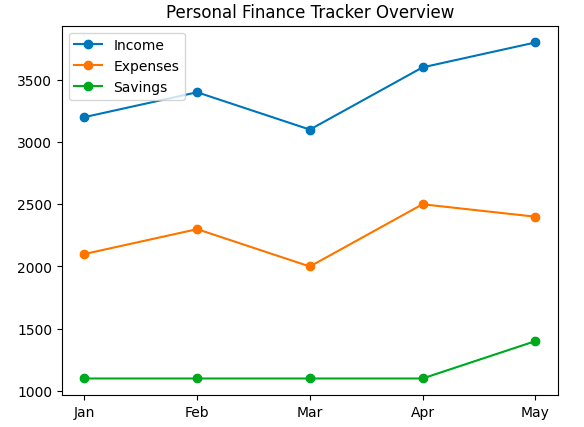
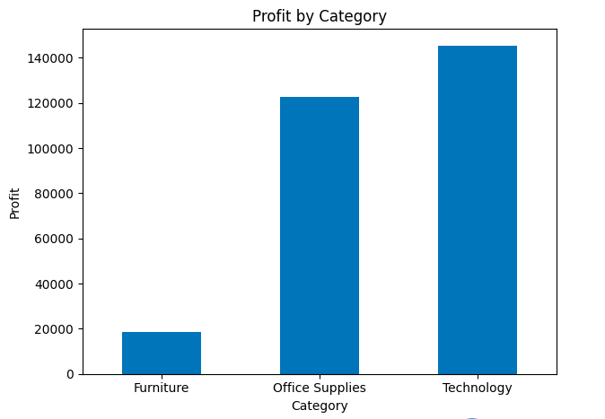
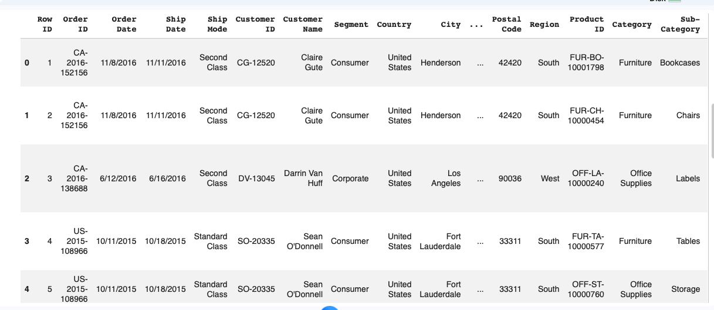

Rodney Jones | Data Analytics Portfolio

Welcome to my data analytics portfolio. This repository showcases projects where I apply Python, data analysis, and visualization techniques to extract meaningful insights from real-world datasets.

⸻

📊 Project 1: Personal Finance Tracker Analysis

Overview

This project analyzes personal income, expenses, and savings trends to better understand financial patterns and decision-making.
## Visualizations

Key Insights

* Income remained relatively stable with slight fluctuations.
* Expenses varied month-to-month, indicating inconsistent spending patterns.
* Savings increased when expenses were controlled, showing improved financial discipline.
## Tools Used
- Python
- Pandas
- Matplotlib
- Google Colab
- GitHub

## Skills Demonstrated
- Data cleaning
- Data organization
- Exploratory data analysis
- Data visualization
- Trend analysis
- Financial insight reporting

## Key Insights
- Compared monthly income and expenses
- Tracked savings patterns over time
- Visualized financial trends using multiple charts
- Identified how income, spending, and savings changed across each month

## Why This Project Matters
This project demonstrates my ability to work with structured data, create meaningful visualizations, and explain financial trends in a clear, business-friendly way. It also reflects my continued growth in data analytics through hands-on project work.

## Project File
View the notebook here:  
[Personal Finance Tracker Analysis](./Personal_Finance_Tracker_Analysis.ipynb)

Project 2: E-Commerce Sales Performance Analysis

Overview

This project analyzes e-commerce sales data to identify revenue trends, category performance, and profitability.

Visualizations

Monthly Sales Trend

Sales by Category

Profit by Category

Key Insights

Sales trends highlight fluctuations over time, indicating potential seasonality.

Certain categories generate higher revenue than others.

Profit analysis shows that high sales do not always translate into high profitability.

Some categories significantly outperform others in both revenue and profit.

🛠️ Tools & Skills

Python (Pandas, Matplotlib)

Data Cleaning & Transformation

Exploratory Data Analysis (EDA)

Data Visualization

Business Insight Generation

Google Colab & Google Drive

GitHub

📁 Project Files
Personal Finance Analysis

E-Commerce Sales Analysis

